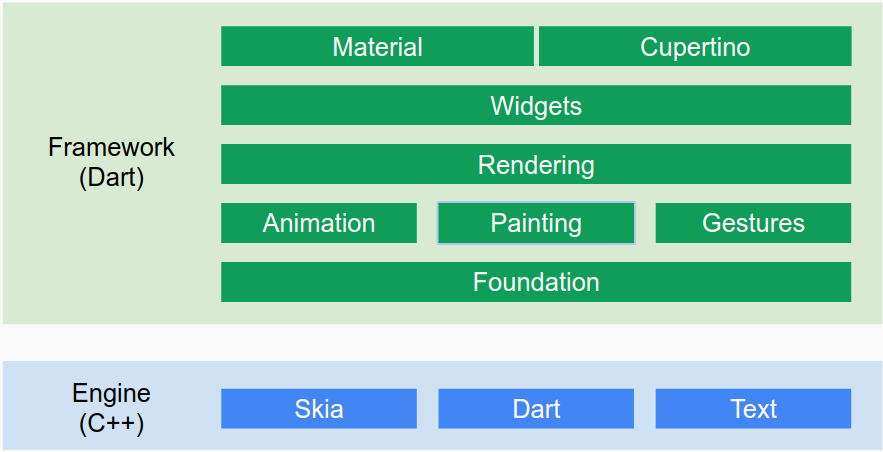

# Table of Contents
- [Cross-platform frameworks](#cross-platform-frameworks)
  - [Flutter](#flutter-by-google)
  - [React Native](#react-native-by-facebook)
  - [Xamarin](#xamarin-by-microsoft)

# Cross-platform frameworks

## [Xamarin](https://visualstudio.microsoft.com/xamarin/) by Microsoft
- builds native apps for Android, iOS, and Windows
- use Visual Studio C# for Windows or Mac
- Xamarin SDKs, Xamarin.Forms, and Mono runtime are open source on GitHub
  
## [React Native](https://facebook.github.io/react-native/) by Facebook 
- https://github.com/facebook/react-native
- builds native apps on iOS and Android
- React's declarative UI framework
- Builds native mobile apps using JavaScript and React
- can call native code without too much trouble.
  
## [Flutter](https://flutter.dev/) by Google 
- https://github.com/flutter/flutter
- builds native apps on iOS and Android
- Supported OS: Linux, Mac, Windows
- Language: Dart
- Plugins for Android Studio, IntelliJ IDEA, and VS Code
- ships with a set of high quality [Material Design and Cupertino (iOS-style) widgets](https://flutter.dev/docs/development/ui/widgets), layouts, and themes
- [provides APIs](https://flutter.dev/docs/testing) for writing unit and integration tests

[Flutter Architecture](https://docs.google.com/presentation/d/1cw7A4HbvM_Abv320rVgPVGiUP2msVs7tfGbkgdrTy0I/edit#slide=id.gbb3c3233b_0_162)

## Ionic
- built in Web Views

## Cordova
- built in Web Views

## Appcelerator
- built in Web Views

## PhoneGap
- built in Web Views
